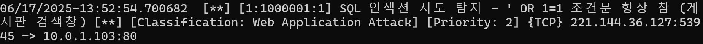

# 🛡️ Suricata IDS 탐지 및 실습

Ubuntu 환경에서 Suricata를 설치하고, 커스텀 룰셋을 이용해 웹 기반 공격(SQL Injection, XSS 등)을 탐지합니다.

  

---

## 📌 프로젝트 개요

- **IDS(침입 탐지 시스템)** 이해 및 실습
- Suricata를 통한 **패킷 분석 및 공격 탐지**
- **커스텀 룰셋**을 이용한 탐지 정확도 향상
- `eve.json` 로그 확인 및 시각화 가능 구조 구성

---

## 📂 목차

1. [환경 및 사전 조건](#1-환경-및-사전-조건)
2. [Suricata 설치](#2-suricata-설치)
3. [설정 파일 구성](#3-설정-파일-구성)
4. [커스텀 룰셋 작성](#4-커스텀-룰셋-작성)
5. [공격 시뮬레이션 및 테스트](#5-공격-시뮬레이션-및-테스트)
6. [탐지 결과 보기](#6-탐지-결과-보기)
7. [파일 구성](#7-파일-구성)
8. [참고 자료](#8-참고-자료)

---

## 1-환경-및-사전-조건
